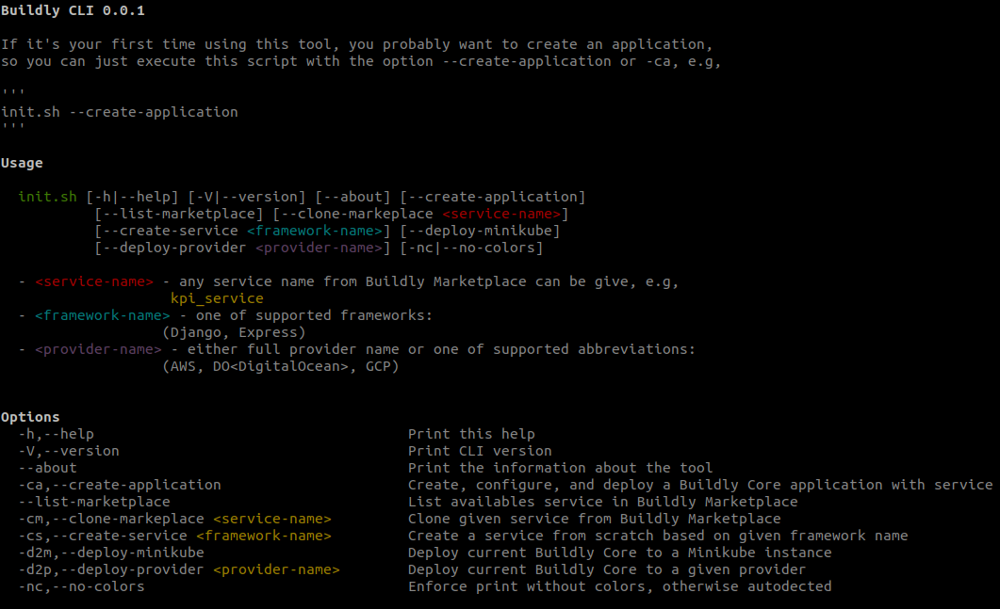

# Buildly CLI

Command line tool for creating and configuring your Buildly application.

## Getting Started

After forking and installing all prerequisites, you can run the following command to start creating your first app `init.sh --create-application`. The instructions will help you to create and configure a completely new Buildly application with services pulled directly from Buildly Marketplace.

### Prerequisites

Basic prerequisites are:
* Bash command line
* cURL version 7
* git version 2.17

You might also need one or more of the following apps depending on the functionalities you're going to use:
* kubectl
* docker version 19+
* helm version 2+
* minikube version 1.5
* python version 3
* aws-cli version 1.16+
* gcloud version 273.0+
* doctl version 1.36+

### Installing

This repository has links to submodules.  
After cloning the repository initalize the sub modules:
>`git submodule update --init`

To pull the latest changes from the submodules use:
>`git pull --recurse-submodules`

To commit changes use:
>`git commit -am 'added module`

To get started just run the init.sh script

MacOS:
`source init.sh`

Linux:
`bash init.sh`

## Contributing

Please read [CONTRIBUTING.md](https://github.com/buildlyio/docs/blob/master/CONTRIBUTING.md) for details on our code of conduct, and the process for submitting pull requests to us.

## Versioning

We use [SemVer](http://semver.org/) for versioning. For the versions available, see the [tags on this repository](https://github.com/buildlyio/buildly-cli/tags).

## Authors

* **Buildly CLI** - *Initial work*

See also the list of [contributors](https://github.com/buildlyio/buildly-cli/graphs/contributors) who participated in this project.

## License

This project is licensed under the GPL v3 License - see the [LICENSE](LICENSE) file for details.
